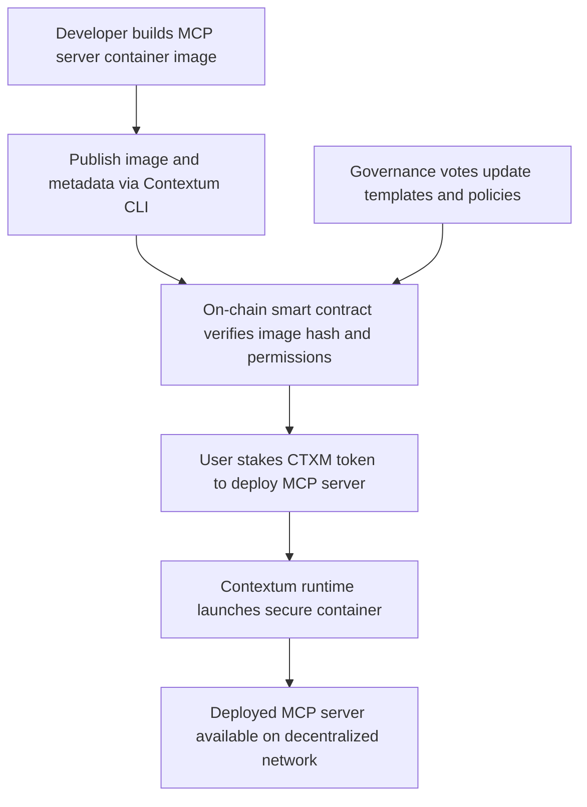

# Contextum, Simplifying MCP Server Distribution for a Decentralized AI Future

---

## Overview

Contextum is building the infrastructure layer to deploy, manage, and govern Model Context Protocol (MCP) servers in a decentralized, secure, and scalable way, starting with Ethereum Virtual Machine (EVM) compatible blockchains.

Our platform unlocks frictionless deployment of AI model context servers with cryptographic verification, token-based permissioning, and on-chain governance.

---

## Problem

AI applications increasingly require distributed context serving for decentralized agents. However, deploying MCP servers today is complex, insecure, and lacks transparency:

- Manual deployment processes cause errors and inconsistencies  
- Secrets and tokens are stored insecurely  
- No on-chain verification or audit trail exists  
- Lack of standard infrastructure hinders mass adoption  

---

## Our Solution

Contextum offers a turnkey solution with:

- **Secure, containerized MCP server runtimes** with minimal privileges  
- **On-chain smart contracts** that verify container images and deployment permissions  
- **Tokenized governance (CTXM)** to control access, upgrades, and fees  
- **Developer-friendly CLI** tools to simplify deployment workflows  
- **Auditability** through cryptographically signed deployments linked to wallet identities  

---

## How It Works

---

## Current Status

- MVP EVM MCP server implemented in TypeScript and Bun  
- Working CLI for local deployment and testing  
- Basic smart contracts for image hash verification deployed on Ethereum testnet  
- Interactive playground available at [app.contextum.org](https://app.contextum.org)  
- Initial tokenomics and governance model designed  

---

## Roadmap

| Timeline  | Milestones                             |
| --------- | ------------------------------------ |
| Phase 1   | Complete secure runtime and CLI MVP  |
| Phase 2   | Enable decentralized image registry  |
| Phase 3   | Launch DAO governance and community templates |
| Phase 4  | Enterprise integrations; IPFS logging |

---

## Tokenomics

CTXM is an ERC-20 token that powers Contextum’s ecosystem:  

- Staking CTXM grants rights to deploy and govern MCP servers  
- Voting on governance proposals and protocol upgrades  
- Fee discounts and access to premium server templates  

Total Supply: 100 million CTXM  
Initial distribution includes ecosystem incentives, team vesting, liquidity, and reserves.

---

## Why Invest in Contextum?

- Positioned at the intersection of **AI infrastructure** and **decentralized governance**  
- First-mover in providing **secure, auditable MCP server deployment**  
- Built on Ethereum L1 with plans for Layer 2 scalability  
- Experienced team and advisory network in blockchain and AI domains  

---

## Get Involved

- Explore the platform: [app.contextum.org](https://app.contextum.org)  
- View code and docs: [github.com/ContextumAI](https://github.com/ContextumAI)  
- Contact us: founders@contextum.ai  

---

## License

MIT License © 2025 Contextum Team
